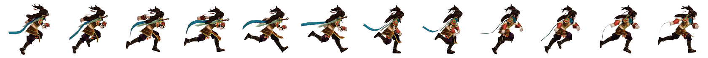

# 动画

两个状态用过渡，多个状态用动画

语法

### 定义动画

两种方式

```css
两个状态的变换 
@keyframes chang {
        from{}
	to{}
      }
```

```css
 多个状态的变换
@keyframes chang {
        0% {
          height: 200px;
        }

        30% {
          width: 500px;
        }

        60% {
          height: 170px;
        }

        100% {
          width: 200px;
        }
      }
```

### 使用动画

```css
animation: 动画名 时间;
```

### 复合动画

linear 匀速

steps（x） 分几步执行

执行次数    1，2，3或者 infinite（无限）

动画方向  到终点再回来  alternate

执行完毕的状态 forwards(停在最后的状态,与无限执行冲突)

延迟 复合函数中,第二次时间就是延迟

### 拆分属性

有一个于hover搭配使用的 暂停

```css
animation-play-state: paused;
```

### 逐帧动画

补间动画：一般都是这种

逐帧动画：做精灵动画使用



步骤：

-- 1.先定义展示区域，这里就是

宽:(1680/12)=140，高:140

--  2.定义动画

在这里就是需要修改图片显示的位置

```css
     @keyframes chang {
默认在最左边
        from {
          background-position: 0 0;
        }
最后在最右边
        to {
          background-position: -1680px 0;
        }
      }
```

--  3.使用动画

```css
 animation: chang 0.5s steps(12) infinite
记住:图片有多少个,就设置多少steps(),多少帧
```

### 组合动画

animation:动画1,动画2


## 注意点

当我们定义动画时,如果from或者0%的时候就是在原盒子的那个起点,那么就不需要定义from了
